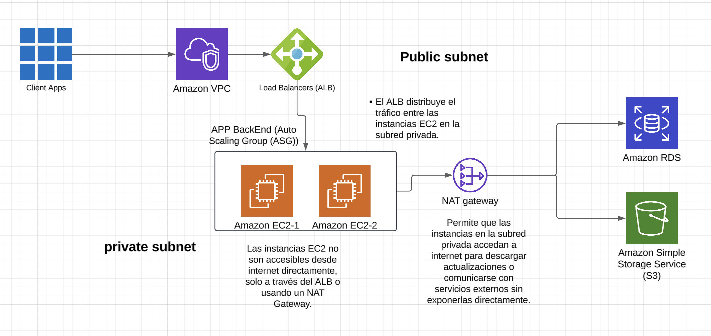

## Part 1: Designing Cloud Infrastructure
### Task:
Design a cloud infrastructure for a scalable web application.
Include components like compute instances, storage, and network configurations.
Use AWS EC2, S3, and VPC to build the basic architecture.

### Steps:

**Arquitectura Propuesta**

**Componentes Principales:**

**Cómputo:**

Se utilizara `AWS EC2` para alojar el backend de la aplicación.
Las instancias estarán en un `Auto Scaling Group (ASG)` para manejar el incremento o decremento de tráfico.

**Almacenamiento:**

`AWS S3` será el almacenamiento para archivos estáticos como imágenes, CSS, y JavaScript.
`RDS` será utilizado para almacenar datos de la aplicación.

**Red:**

Configurar una `AWS VPC` para aislar recursos:
- *Subred Pública:* Contendrá el `Application Load Balancer (ALB)`.
- *Subred Privada:* Contendrá las `instancias EC2` 



----

## Parte 2: Configuración de IAM

### Roles y Políticas:
### Rol para Desarrolladores:

Permitir acceso a las instancias EC2 de entornos de desarrollo, pero restringir el acceso a producción.

-  política:

```json
{
  "Version": "2012-10-17",
  "Statement": [
    {
      "Effect": "Allow",
      "Action": "ec2:DescribeInstances",
      "Resource": "*"
    }
  ]
}
```

### Rol para Administradores:
Control total de la infraestructura, pero sin acceso a datos sensibles en S3.

- política:

``` json
{
  "Version": "2012-10-17",
  "Statement": [
    {
      "Effect": "Allow",
      "Action": "*",
      "Resource": "*"
    },
    {
      "Effect": "Deny",
      "Action": "s3:GetObject",
      "Resource": "arn:aws:s3:::datos-sensibles/*"
    }
  ]
}
```
### Rol para Servidores de Aplicaciones:

Permisos para leer contenido en S3 y escribir logs.

- Ejemplo de política:

```json
{
  "Version": "2012-10-17",
  "Statement": [
    {
      "Effect": "Allow",
      "Action": [
        "s3:GetObject",
        "s3:PutObject"
      ],
      "Resource": "arn:aws:s3:::app-logs/*"
    }
  ]
}
```

---

## Parte 3: Estrategia para Manejo de Recursos

### Elementos Clave:

#### Auto Scaling:
Se configura un grupo de escalado automático para las instancias EC2:
- Mínimo: 2 instancias.
- Máximo: 10 instancias.
- Métrica de escalado: Uso de CPU (por ejemplo, escalar si el uso de CPU supera el 70%).

#### Load Balancing:
Se usara un Application Load Balancer para:
- Distribuir tráfico entre las instancias EC2.
- Comprobar el estado de las instancias para redirigir tráfico solo a las saludables.
#### Optimización de Costos:
- Se usara AWS Budgets para monitorear gastos.
- Configurar políticas de ciclo de vida en S3 para mover datos antiguos a clases de almacenamiento más baratas (como S3 Glacier).
### Parte 4: Implementación Teórica

#### Flujo de Datos:
1. El cliente realiza una solicitud desde el navegador.
2. La solicitud llega al Application Load Balancer (ALB).
3. El ALB redirige el tráfico a una instancia EC2 que está corriendo el backend.
4. El backend:
- - Obtiene datos de la base de datos o de AWS S3.
- - Responde al cliente.
#### Roles de los Servicios:
1. ALB:
- Distribuye tráfico entre instancias EC2.
- Realiza comprobaciones de estado.
2. Instancias EC2:
- - Procesan las solicitudes del cliente.
- - Generan logs y los almacenan en S3.
3. AWS S3:
- - Almacena contenido estático como imágenes, archivos CSS y JavaScript.
- - Almacena logs generados por las instancias.
### Parte 5: Discusión y Evaluación

1. Por qué se eligieron estos servicios:
   - EC2: Proporciona la capacidad de manejar un backend dinámico y escalable.
   - S3: Ideal para almacenar y servir contenido estático de manera eficiente y económica.
   - VPC: Proporciona seguridad y control sobre la red.
2. Seguridad a través de IAM:
   - Las políticas de IAM se configuraron para minimizar los permisos de cada rol, siguiendo el principio de menor privilegio.
   - Esto reduce el riesgo de acceso no autorizado a recursos críticos.
3. Estrategia de Recursos:
   - La combinación de Auto Scaling y Load Balancing asegura que la aplicación pueda manejar picos de tráfico sin problemas.
   - Los presupuestos y políticas de ciclo de vida en S3 mantienen los costos bajo control.


