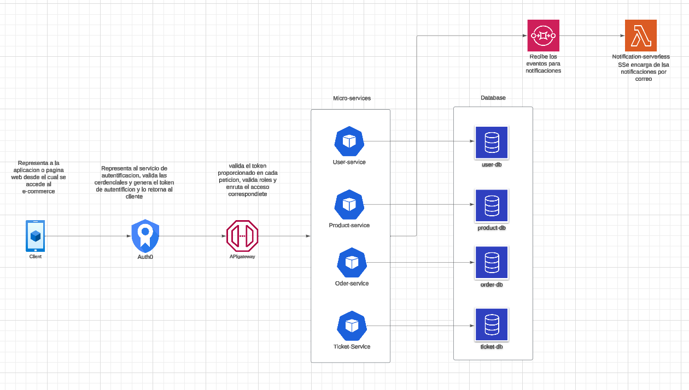

### Objectives: 
Design a microservices architecture based on a given set of requirements.
Simulate the decomposition of a monolithic architecture into microservices.
Reflect on the design decisions and discuss alternative approaches.

### Tasks: 
### Design Exercise: 
- **Application Brief:** Participants are given a description of a monolithic e-commerce application handling user management, product catalog, order processing, and customer support.
- **Task:** Identify and outline potential microservices based on domain-driven design principles. Participants will determine service boundaries, define how services will communicate, and plan how to handle shared data.

### Monolithic E-Commerce Application Description: ###
The application is a traditional e-commerce platform that encompasses all functionalities within a single, unified software architecture. The application handles the following key operations:

- User Management: Manages user profiles, authentication, and authorization. It stores personal information, manages login sessions, and handles user preferences.
- Product Catalog: Maintains a comprehensive list of products, including descriptions, pricing, images, and inventory levels. It supports product search and categorization functionalities.
- Order Processing: Manages all aspects of the ordering process, from cart management to order placement, payment processing, and order history tracking.
- Customer Support: Handles customer inquiries, returns, complaints, and feedback through a ticket-based system integrated with the user and order databases.

The application is built on a single relational database that holds all user data, product information, orders, and customer support interactions. It currently operates on a single code base with a web-based frontend that communicates directly with the backend server.

The platform has been experiencing challenges with scaling during high-traffic periods, frequent downtimes during updates, and increasing difficulty in implementing new features without affecting existing functionalities. The goal is to decompose this monolithic architecture into a microservices-based architecture to address these issues and improve overall agility and scalability.

-----------

## Migración a microservicios

### 1. Identificación de Dominios de Negocio: ###

- **Gestión de Usuarios:** Este dominio se encarga de la gestión de perfiles de usuario, autenticación y autorización. Almacena información personal, gestiona sesiones de inicio de sesión y maneja preferencias de usuario.
- **Catálogo de Productos:** Este dominio mantiene una lista completa de productos, incluidas descripciones, precios, imágenes y niveles de inventario. Admite funcionalidades de búsqueda y categorización de productos.
- **Procesamiento de Pedidos:** Este dominio gestiona todos los aspectos del proceso de pedido, desde la gestión del carrito hasta la colocación del pedido, el procesamiento de pagos y el seguimiento del historial de pedidos.
- **Atención al Cliente:** Este dominio maneja consultas de clientes, devoluciones, quejas y comentarios a través de un sistema de tickets integrado con las bases de datos de usuarios y pedidos.

#### Identificación de subdominios: ##

- Dominios principales (Core Domains): Este subdominio se encarga del procesamiento de pedidos y catalogo de productos debido a su criticidad.
- Dominios de soporte (Supporting Domains): Este subdominio se encarga de la gestión de usuarios y atención al cliente. Dado que habilitan la gestion pero no forman parte de la escencia del dominio
- Dominios genéricos (Generic Domains): Este subdominio se encarga de la gestión de usuarios y atención al cliente. Dado que habilitan la gestion pero no forman parte de la escencia del dominio

### 2. Contextos Delimitados 

Definimos los limites conceptuales y tecnicos de cada dominio, es decir, cada contexto tendra su modelo de datos, logica y reglas de negocio independientes.

#### Contexto de Gestión de Usuarios: ####
- Se encargará de manejar la logica de perfiles de usuarios.
- Permitirá la creacion, actualizacion y eliminacion de usuarios.
- Sincronización con otros contextos (por ejemplo, asociar usuarios a pedidos en el contexto de Pedidos o tickets en el contexto de Atención al Cliente).
- Emision de eventos de dominio: *UserCreated*, *UserUpdated*, *UserDeleted*.

- El modelo de dominio seran: *User*, *Session*, *Preferences*.

#### Contexto de Catálogo de Productos: ####
- Se encargara de manejar la logica de inventarios, categorias y busqueda de productos.
- El modelo de dominio seran: *Product*, *Category*, *Inventory*.

#### Contexto de Procesamiento de Pedidos: ####
- Se encarga de gestionar el flujo de ordenes, desde el carrito de compras hasta la confirmacion de la orden.
- El modelo de dominio seran: *Order*, *Cart*, *Payment*.

#### Contexto de Atención al Cliente: ####
- Se encarga de administrar los tickets relacionados con usuarios y pedidos.
- El modelo de dominio seran: *Ticket*, *Comment*, *Status*.

### 3. Definición de Servicios: ###

- Los servicios se definen en base a los contextos delimitados, cada servicio sera responsable de un conjunto de operaciones relacionadas con un dominio especifico.
- Los servicios estaran delimitados acorde a cada dominios descrito asegurando que cada servicio tenga su propio modelo de datos y logica de negocio, de igual forma la comunicacion entre ellos sera a travez de eventos y servicios RestFul, asegurando una alta cohesion y bajo acoplamiento.
- Las funcionalidades compartidas seran: **Registro de Logs**

### Comunicación entre Servicios: ###
- **Síncrona:** Se utilizara para operaciones que requieran una respuesta inmediata, como la autenticacion de usuarios.
    - Para esto se hara uso de servicios RestFul para operaciones que requieran respuesta inmediata, como registro de pedido.
- **Asíncrona:** Se utilizara para operaciones que no requieran una respuesta inmediata, como el envio de correos electronicos.
    - Para esto se hara uso de eventos para operaciones que no requieran respuesta inmediata, como lo son las actualizaciones en el inventario y notificaciones.
- **Eventos de dominio:** Se utilizaran eventos que otros contextos van a consumir, por ejemplo: Al crear un pedido, el contexto *Pedidos* lanzara un evento de "Orden creada (OrderCreated)" y el contexto de atencion al cliente debera escuchar al evento para vincular tickets al pedido.
- **API Gateway:** Se utilizara un API Gateway para enrutar las peticiones a los servicios correspondientes, asi como para manejar la autenticacion y autorizacion de los usuarios.
- **Balanceo de Carga:** Se implementara un balanceador de carga para distribuir las peticiones entre los diferentes servicios y garantizar la escalabilidad y disponibilidad del sistema.
- **Auth0:** Se utilizara Auth0 para gestionar la autenticacion y autorizacion de los usuarios, permitiendo la integracion con diferentes proveedores de identidad y la gestion de tokens de acceso.

### Modelos de Datos: ###
- **Gestión de Usuarios:**
    - **User:** 
        - *id*: Identificador único del usuario.
        - *name*: Nombre del usuario.
        - *email*: Correo electrónico del usuario.
        - *password*: Contraseña del usuario.
    - **Session:** 
        - *id*: Identificador único de la sesión.
        - *user_id*: Identificador del usuario asociado a la sesión.
        - *token*: Token de autenticación de la sesión.
    - **Preferences:** 
        - *id*: Identificador único de las preferencias.
        - *user_id*: Identificador del usuario asociado a las preferencias.
        - *theme*: Tema preferido del usuario.
- **Catálogo de Productos:**
    - **Product:** 
        - *id*: Identificador único del producto.
        - *name*: Nombre del producto.
        - *description*: Descripción del producto.
        - *price*: Precio del producto.
        - *category_id*: Identificador de la categoría del producto.
        - *inventory_id*: Identificador del inventario asociado al producto.
    - **Category:**
        - *id*: Identificador único de la categoría.
        - *name*: Nombre de la categoría.
    - **Inventory:**
        - *id*: Identificador único del inventario.
        - *product_id*: Identificador del producto asociado al inventario.
        - *quantity*: Cantidad disponible del producto.
- **Procesamiento de Pedidos:**
    - **Order:** 
        - *id*: Identificador único de la orden.
        - *user_id*: Identificador del usuario que realizó la orden.
        - *cart_id*: Identificador del carrito asociado a la orden.
        - *payment_id*: Identificador del pago asociado a la orden.
        - *status*: Estado de la orden (pendiente, completada, cancelada, etc.).
        - *total_amount*: Monto total de la orden.
        - *created_at*: Fecha de creación de la orden.
    - **Cart:**
        - *id*: Identificador único del carrito.
        - *user_id*: Identificador del usuario asociado al carrito.
        - *items*: Lista de productos en el carrito.
    - **Payment:**
        - *id*: Identificador único del pago.
        - *order_id*: Identificador de la orden asociada al pago.
        - *amount*: Monto del pago.
        - *method*: Método de pago (tarjeta de crédito, PayPal, etc.).
- **Atención al Cliente:**
    - **Ticket:** 
        - *id*: Identificador único del ticket.
        - *user_id*: Identificador del usuario asociado al ticket.
        - *order_id*: Identificador de la orden asociada al ticket.
        - *status*: Estado del ticket (abierto, cerrado, en progreso, etc.).
        - *created_at*: Fecha de creación del ticket.
    - **Comment:**
        - *id*: Identificador único del comentario.
        - *ticket_id*: Identificador del ticket asociado al comentario.
        - *user_id*: Identificador del usuario que realizó el comentario.
        - *content*: Contenido del comentario.
    - **Status:**
        - *id*: Identificador único del estado.
        - *name*: Nombre del estado (abierto, cerrado, en progreso, etc.).

### Servicios: ###
- **Gestión de Usuarios:**
    - **Servicios:**
        - *UserService*: Gestiona la creación, actualización y eliminación de usuarios.
        - *SessionService*: Gestiona la creación y eliminación de sesiones de usuario.
        - *PreferencesService*: Gestiona las preferencias de usuario.
    - **Eventos de Dominio:**
        - *UserCreated*: Se emite al crear un usuario.
        - *UserUpdated*: Se emite al actualizar un usuario.
        - *UserDeleted*: Se emite al eliminar un usuario.
- **Catálogo de Productos:**
    - **Servicios:**
        - *ProductService*: Gestiona la creación, actualización y eliminación de productos.
        - *CategoryService*: Gestiona la creación, actualización y eliminación de categorías.
        - *InventoryService*: Gestiona la actualización de inventarios.
- **Procesamiento de Pedidos:**
    - **Servicios:**
        - *OrderService*: Gestiona la creación, actualización y eliminación de órdenes.
        - *CartService*: Gestiona la creación, actualización y eliminación de carritos.
        - *PaymentService*: Gestiona la creación de pagos.
    - **Eventos de Dominio:**
        - *OrderCreated*: Se emite al crear una orden.
        - *OrderUpdated*: Se emite al actualizar una orden.
        - *OrderDeleted*: Se emite al eliminar una orden.
- **Atención al Cliente:**
    - **Servicios:**
        - *TicketService*: Gestiona la creación, actualización y eliminación de tickets.
        - *CommentService*: Gestiona la creación de comentarios en tickets.
        - *StatusService*: Gestiona la creación, actualización y eliminación de estados de tickets.
    - **Eventos de Dominio:**
    - *TicketCreated*: Se emite al crear un ticket.
    - *TicketUpdated*: Se emite al actualizar un ticket.
    - *TicketDeleted*: Se emite al eliminar un ticket.

### Flujos de proceso: ###
- **Autenticacion**: 
    - El usuario envía sus credenciales al servicio de autenticación.
    - El servicio de autenticación valida las credenciales del usuario y emite un token de acceso.
    - El servicio de gestión de usuarios crea un nuevo usuario si no existe.
- **Creacion de usuario**
    - El usuario envía una solicitud de creación de usuario con sus datos personales.
    - El servicio de gestión de usuarios crea un nuevo usuario en la base de datos.
    - Se emite un evento de "Usuario creado (UserCreated)".
- **Creación de Pedido:**
    - El usuario agrega productos al carrito.
    - El usuario confirma la orden y realiza el pago.
    - El servicio de procesamiento de pedidos crea una nueva orden y actualiza el inventario.
    - Se emite un evento de "Orden creada (OrderCreated)".
- **Creación de Ticket:**
    - El usuario envía una solicitud de creación de ticket con su consulta.
    - El servicio de atención al cliente crea un nuevo ticket asociado al usuario.
    - Se emite un evento de "Ticket creado (TicketCreated)".
- **Actualización de Inventario:**
    - El servicio de catálogo de productos recibe una notificación de actualización de inventario.
    - El servicio actualiza la cantidad disponible de un producto en el inventario.
    - Se emite un evento de "Inventario actualizado (InventoryUpdated)".
   
**Nota:** Despues de la autenticacion o creacion del usuario, se debera mandar el token en el header en cada peticion para que el gateway gestione los accesos a cada endpoint.

### 4. Plan de Migración: ###
- **Fase 1: Creación de Servicios:**
    - Crear servicios independientes para cada contexto delimitado.
    - Implementar la lógica de negocio y los modelos de datos específicos para cada servicio.
    - Establecer la comunicación entre los servicios mediante eventos y servicios RestFul.
- **Fase 2: Migración de Datos:**
    - Migrar los datos existentes de la base de datos monolítica a las bases de datos de cada servicio.
    - Asegurar la integridad y consistencia de los datos durante la migración.
- **Fase 3: Implementación de API Gateway:**
    - Configurar un API Gateway para enrutar las peticiones a los servicios correspondientes.
- **Fase 4: Pruebas y Validación:**
    - Realizar pruebas exhaustivas para validar el funcionamiento de los servicios y la comunicación entre ellos.

### 5. Reflexión sobre el Proceso de Diseño: ###
Uno de los principales retos al migrar de monolito a microservicios es determinar los límites de los servicios dentro del monolito existente, lo cual requiere una comprensión profunda de los dominios y sus interacciones. Además, gestionar la consistencia de datos entre los distintos servicios es crucial para mantener la integridad del sistema. Planificar una migración sin afectar la aplicación en producción añade complejidades adicional, demandando una estrategia cuidadosamente orquestada, y manterner una constante comunicacion entre los integrantes del equipo, negocio y cliente es fundamental para lograrlo con exito.

### 6. Diagrama de Arquitectura: ###
[]
